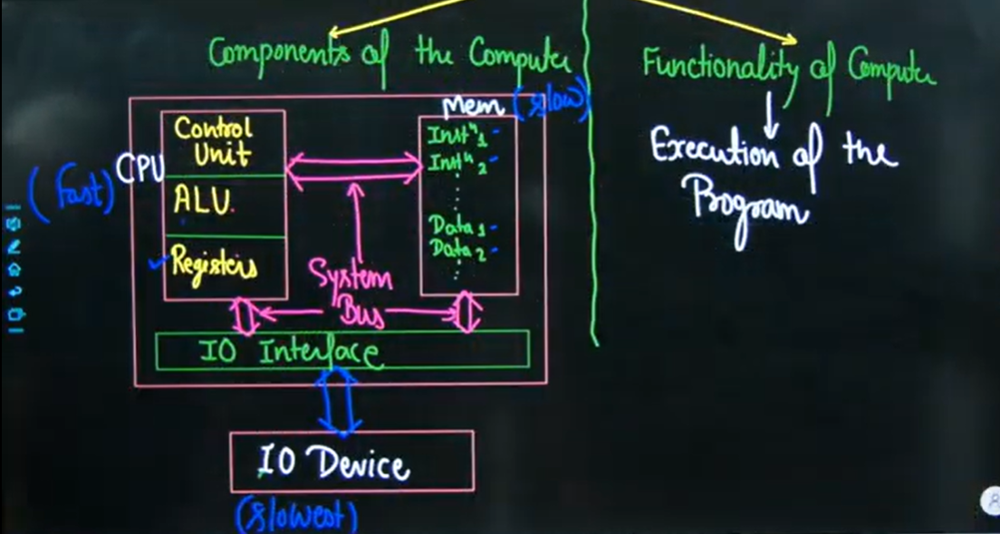
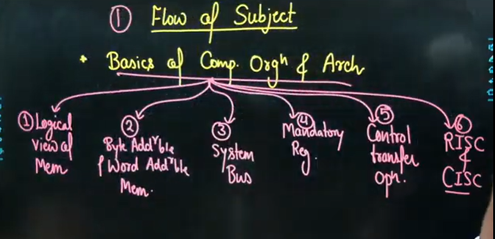
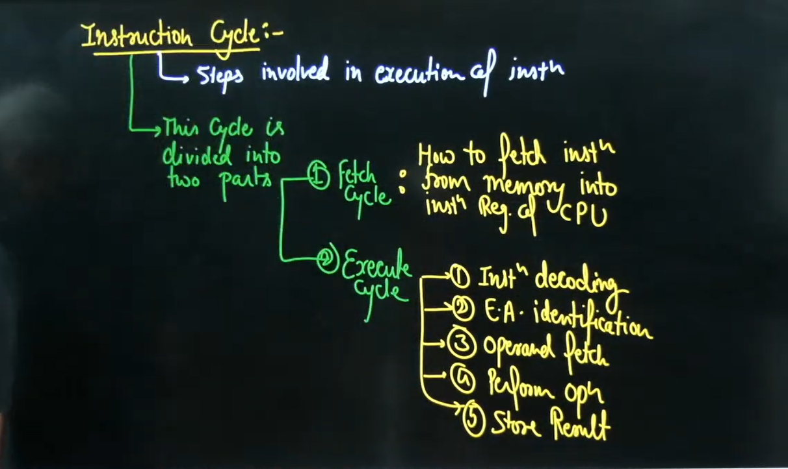
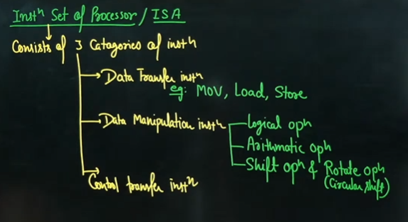
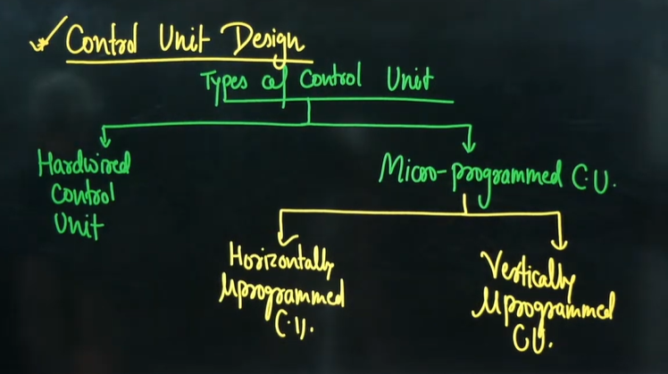

# Introduction to Computer Organization & Architecture (COA) | Computer Organization | by Vishal Sir

**Section 3: Computer Organization and Architecture**  
* Machine instructions and addressing modes. 
* ALU, data‐path and control unit. 
* Instruction pipelining, pipeline hazards. 
* Memory hierarchy: cache, main memory and secondary storage; 
* I/O interface(interrupt and DMA mode).

> किसी से भी पूछ लो, सर हमने तो बस COA निकाल लिया था । In University exam .

Complete Syllabus can be divided into 2 parts  

1. Components of the computer
2. Functionality of the computer
   1. Execution of the program

## Flow of Subject

* Basics of Comp Org & Arch.

## Components of Computer

1. Memory(Storage)
2. CPU (Processing)
3. I/O devices

## 1st Component will be Memory Organization

* Above is not dependent on anything and can be learnt anytime

* Memory Organization
  * Types of Memory Organization & their Order
    * Hierarchal Memory organization
    * Simultaneous Memory organization
  * Concept of Cache
    * Logical Org of Main Mem & Cache Mem into blocks
    * Mapping Techniques
      * Fully Associative Mapping
      * Direct Mapping
      * P.way set Associative Mapping
  * Replacement Algo
    * FIFO
    * LRU
  * Updating Techniques
    * Write Through updating technique
    * Write back updating technique
  * Multilevel Cache

## Instruction Cycle

### Flag Register / PSW

* This Register Consists of different flag bits/status bits
  * Carry flag
  * Parity flag
  * Sign flag
  * Zero flag
  * Auxiliary Carry flag
  * Overflow 
  * Interrupt flag
  * Direction flag
  * Trap flag

Flag bits are set or Reset based on output of ALU

## Instruction set of Processor / ISA

* **Control Transfer Instruction**
  * Unconditional Control transfer Operation
  * Conditional Control tranfer operation

## Subroutine

## Interrupt

Above 2 will depend on Control transfer operation

## => 2nd component of computer i.e. (CPU)

* Components of CPU
  * Register
  * ALU
  * Control Unit
    * It is used to generate control signals which are used to execute micro-operation
    * Micro-operation - To execute one instruction we may need to execute multiple micro-instruction

* Control unit Design
  * Types of control unit
    * Hardwired control unit
    * Micro-programmed Control Unit(CU)
      * Horizontally microprogrammed CU
      * Vertically microprogrammed CU

## => High Performance Computer Architecture

* How to measure performance of a system
  * Execution time
  * Throughput

* Execution time
  * Basically It is the CPU time to execute any program
  * How to compare performance of two system
    * Using Speedup factor

## Flynn's Classification of High Performance Computer Architecture
1. SISD(Single Inst Single data)
   1. Pipelining concept is used to improve the performance of SISD system
2. SIMD(Single Inst Multiple data)
3. MISD(Multiple Inst Multiple data)
4. MIMD(Multiple Inst Multiple data)

### Instruction Pipelining

1. Designing & Working of Pipeline
2. Different types of pipeline
3. Performance measurement using pipeline & speed-up
4. Dependencies in the Pipeline
   1. Data Dependency
   2. Structure Dependency (Resource Conflict)
   3. Control Dependency
   4. Pipeline Hazards
      1. Read after write hazard(True-data dependency)
      2. Write after read hazard(Anti-dependency)
      3. Write after write hazard(Output dependency)

## 3rd Component of Computer i.e. IO

* Magnetic disk and its access time
* IO interfaces
  * Interrupt driven IO
  * DMA
  * Programmed IO

## Miscellaneous part
* Booth's Algorithm
* Reservation table
* Refreshing of DRAM chip

ऊपर हमने जमीन तैयार कर लिया , अब कल से ईंट से ईंट जोड़ेंगे।
बाद में ऊपर वाले लेक्चर को 2x speed में देख लेना ।  

