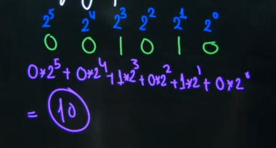
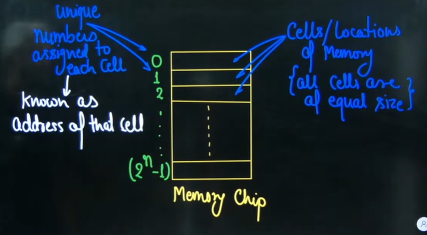
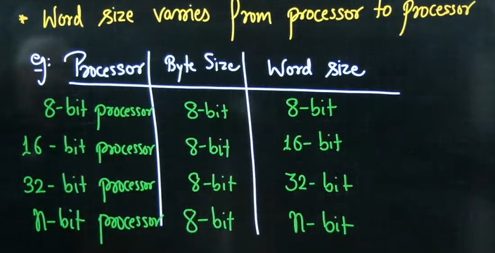
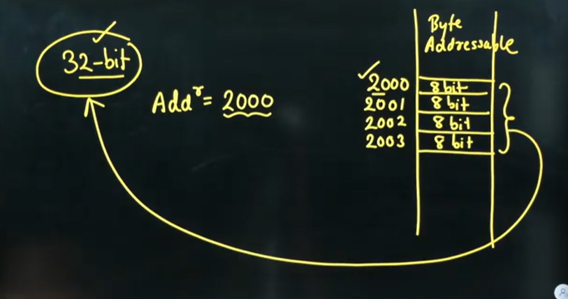

# Lec #01 Basics Of COA | Computer Organization | by Vishal Sir

* **Functionality of Computer**
  * Functionality of the computer is execution of **program**
  * What is Program?
    * It is sequence of instructions along with data
  * **What is Instruction?**
    * Programming statement is different which you want to do
    * Compiler convert those programming statement into sequence of instructions
    * Instruction is a binary sequence which is defined inside the processor during the design time of the processor by processor designer(e.g. Addition, substraction, jump, division etc which the designer want it to be supported)
      * ADD, SUB, MUL - there will be a binary pattern defined inside the processor for this instruction
  * **What is Data?**
    * Data is also a binary sequence  which is associated with a value based on weighhing factor

* To satisfy the functionality of computer certain component are required within the computer
* Major components of the computer are
  * Memory(for storage)
  * CPU(for processing)
  * IO(Input output operation)

## Memory

* You don't need to worry about it's physical implemenation
* You just need to visualize memory as logically

* Logical view of Memory

> This is memory chip. It has cells with equal sizes.  
> It will be used to store data/binary patterns  
> It is divided into equal size partions   
> Each partition is called cells or location of memory  

What is memory chip?  
Memory chip is divided into equal size partitions, each partition is called as a cell of memory chip

* Each cell is identified by a unique number known as **address of that cell**
* Why address is used?
  * so that given memory cell is enable
  * CPU needs from that address
  * CPU will assign task to memory controller
  * Memory controller will enable that address cell
  * Memory cell which operation can be performed?
    * Read or write

* Addresses ar used to enable the memory for **memory operation**
* Two type memory operation can be performed on each memory cell i.e. Read or write
* To define which operation needs to be performed in the enabled memory cell control signals are generated by the CPU
  * e.g. for read operation control signal is $\overline{RD}$
  * for write operation control signal is $\overline{WR}$
    * That bar is for understanding purpose
    * Bar means active low

> Memory controller is confused  
> what to do? Read or write  
> how CPU will tell memory controller what to do?
> CPU will pass control signal

* On each memory cell two operation can be performed
  * Read - Control signal for Read operation is $\overline{RD}$
  * Write - Control signal for Read operation is $\overline{WR}$

* If CPU wants to perform a memory operation, then CPU generates a memory request to perform that memory operation
* Memory request will consist of two information
  * Address {on which cell of memory we need to perform the operation}
  * Control signal {It defines that which memory operation needs to be performed}

what is the size of cell? in the chip  

### Byte Addressable memory & word addressable memory  

* Byte size - 1 byte = 8 bit. It is fixed
* Word size - word size is defined as number of bits processed by the processor at a time
  * Word size varies from processor to processor

* **Byte addressable Memory** : In byte addressable memory each memory cell contains 1 Byte (i.e. 8 bit) information
  * i.e. each address point to 8 bit information
* **Word addressable Memory** : In word addressable memory each memory cell contains 1 word information
  * i.e. each address points to 1 word information

> Old processors were 32 bit(4GB RAM)  
> You don't ask what type of n-bit processing when adding a RAM

* Note - Word size may be different for different processors, therefore word size is ambigious. Hence by default memory is Byte addressable

## System Bus

* To Satisfy the objective of the computer i.e. the execution of program, the major components of the computer needs to communicate with each other
  * For the communication there is a need of the communication medium. This communication medium is called as system bus