# Lec #02 Basics Of COA (Part-02)| Computer Organization | GATE 2023 | by Vishal Sir

Memory में Actual Information store कैसे होता है - 

## Endianess Mechanism
Endianess mechanism is used to define the order of storage of bytes in memory  

There are two different endian-ness mechanism
1. Big-Endian
2. Little-endian

3. **Big-endian** - In big-endian mechanism most significant byte of data is stored at **lowest** memory address i.e starting address.

e.g. Consider an hexadecimal no. 3F43 needs to be stored in memory.  

3F - Most significatnt byte  
43 - Least significant byte

* If we need to store this data starting from memory address 1000(in-decimal)
* In big-endian mechanism highest byte of 3F43, i.e. "3F" will be stored at address "1000" and "43" will be stored at address "1001".  

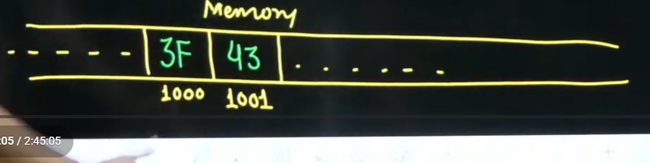

2. **Little-endian** - In little endian mechanism highest  sinificant of data is stored at last memory address

i.e. in little endian mechanism if we want to store hexadecimal no. 3F43 starting from memory address 1000, then "43" will be stored at address 1000 and "3F" (i.e. Most significant byte) will be stored at address 1001  

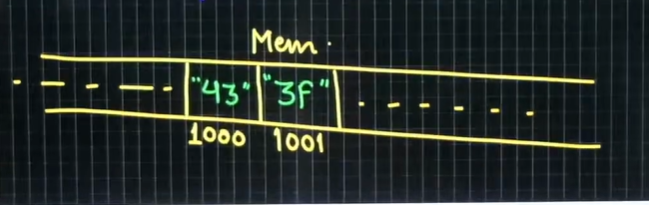

**what's the reason of above?**    
if want to increase the number e.g. 21 to 421. so if I want to increase the value later, so later you can store 4 in the next position

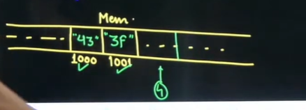

so you need not to change the already stored bits

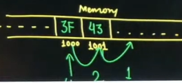  
And if you are using big-endian you needed to shift. It's only good for reading and if you want to increase the value using big-endian you need to shift all the previously stored bytes  

Little-endian mechanism is faster to operate  
Modern day system is Little-endian. So by default little-endian mechanism is used.

**Question** - F3AC21B3  

Above is 32 bit data, represented in hexadecimal format  

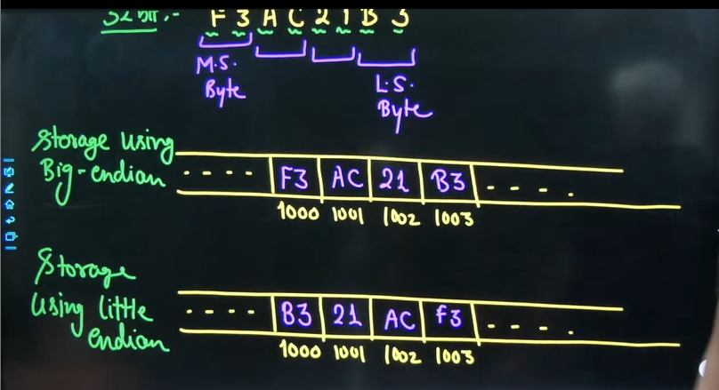

Q. If the numerical value of 2 Byte unsignd integer on a little endian computer is 255 more than that on big-endian computer, which of the following choices represents the unsigned integer on a **little endian computer**(Multiple answer question)  

options  
a. Ox : 6665  
b. Ox : 0001  
c. Ox : 4243  
d. Ox : 0100  

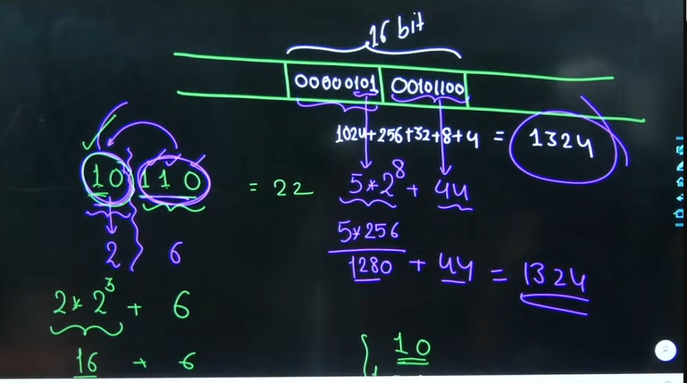

Concept Reference taken - Left shift operation and right shift

* 00000101 in this 101 is left shift by 8 bits. and value of 101 is 5. so left side value will be 5*2^8 = 1280  

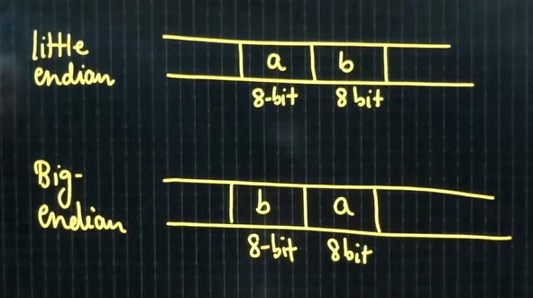

* Value of below number 

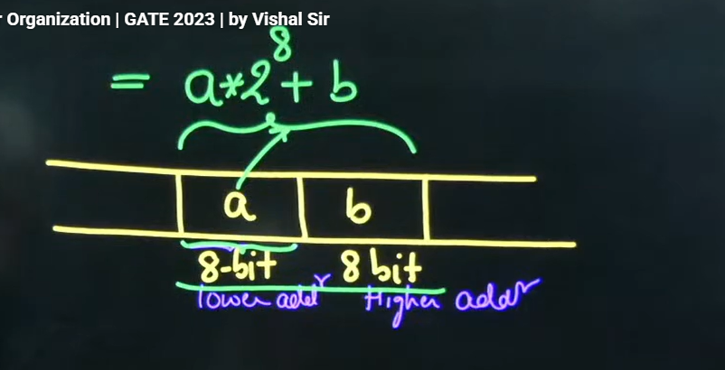

* Value of big endian

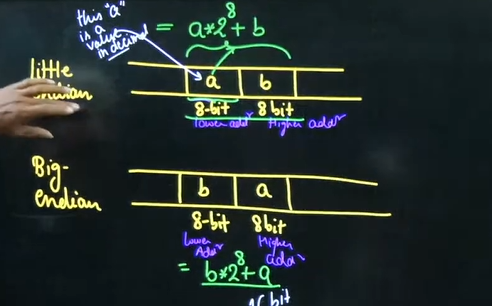

little endian = 255 + Big endian

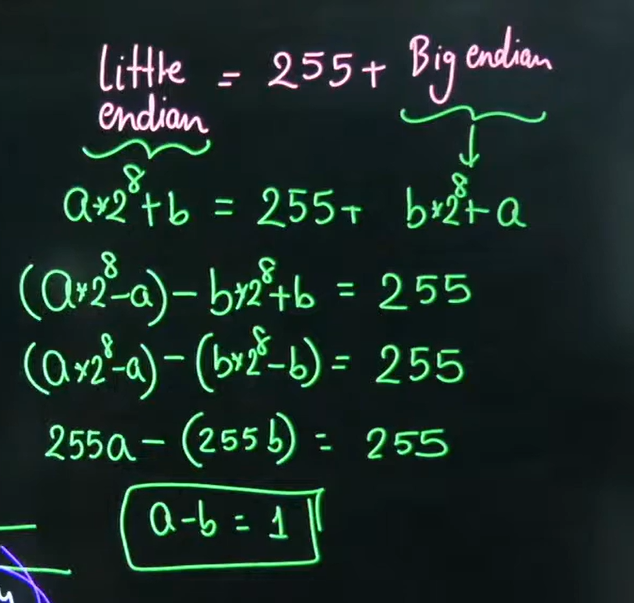

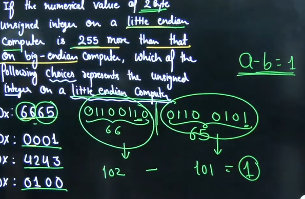

correct options - 

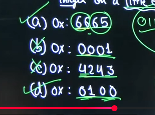

## Memory Chip Representation

* Memory chip are represented using the format,
  * No of cells * size of each cell(in bit)

e.g. 64k * 8-bit memory

where 64k - no of cells in memory = 64k = 2^16
and size of each cell = 8 bit

Note - A larger size memory can be designed using multiple smaller size memory chips  

Question - How many memory chips of size 32x8 bit are needed to design a memory of size 128x8 bit and how are they connected

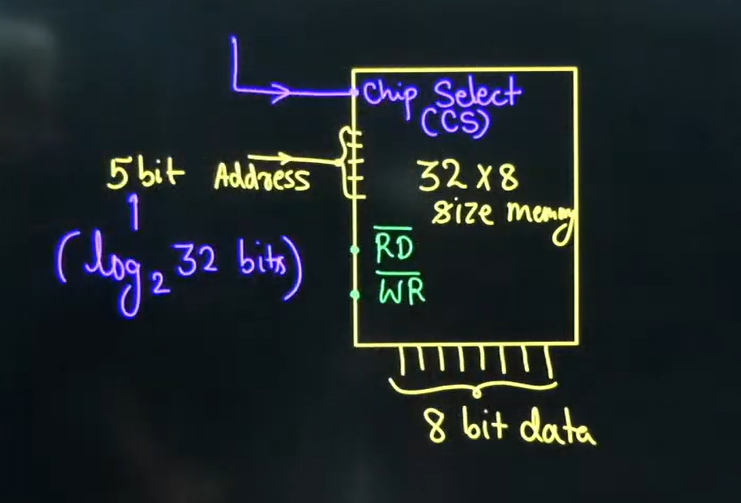

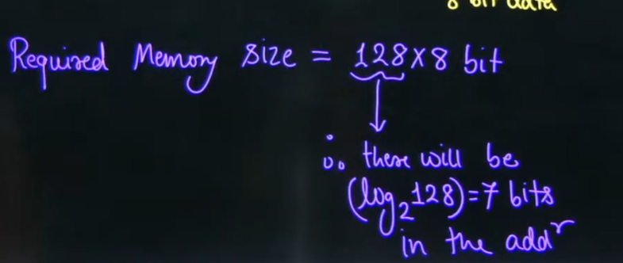

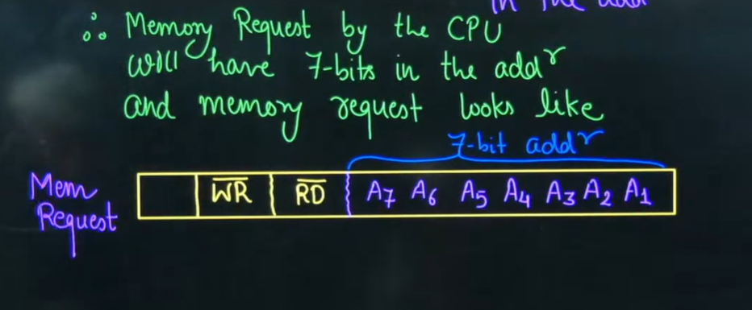

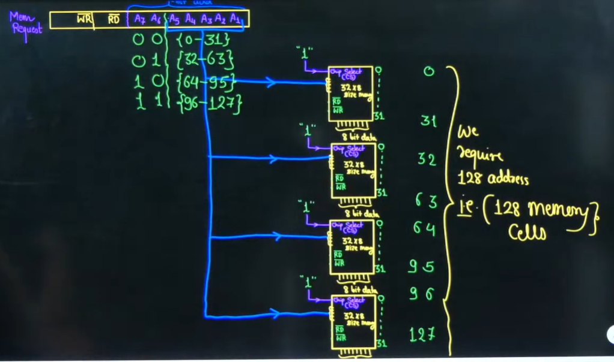

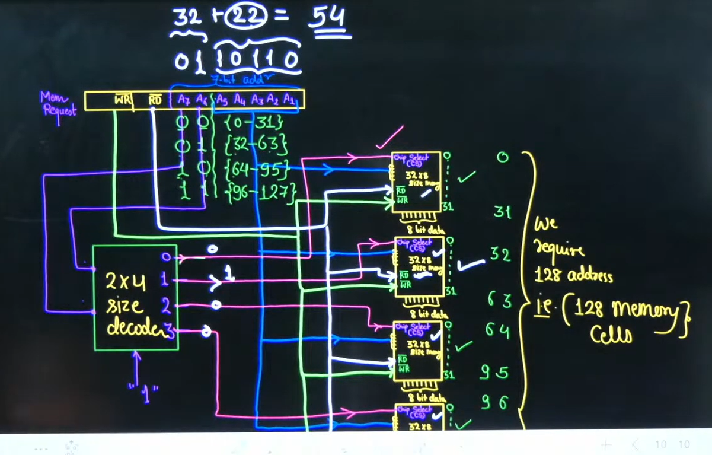