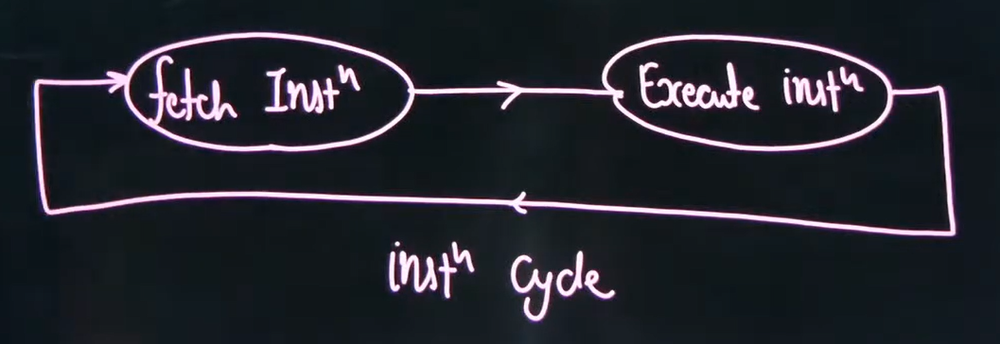
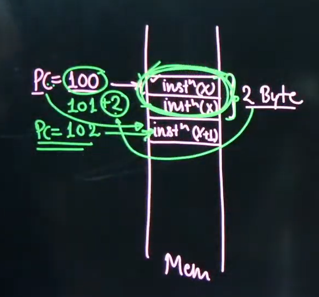

# Lec #03 Introduction to Instruction Cycle | Computer Organization | GATE 2023 | by Vishal Sir

Instruction cycle describes the steps involved in the execution of instruction  

1. Instruction fetch
2. Instruction decoding
3. Operand fetch
4. Perform operation
5. Store Result

* Instruction cycle consist of 2 sub-cycles
  * Instruction fetch sub-cycle
  * Execute sub-cycle - 2nd step to 4 step

1. Instruction Fetch - In this sub-cycle instruction is tranferred from memory to CPU based on the address present in Program Counter(PC) register, this process is called Instruction fetch.
By the end of instruction fetch PC register value is incremental by "step-size" to point the next instruction in the sequence

* Step size is the size of currently fetched instruction
* Step size may be fixed or may vary
* If processor supports fixed length instruction then step-size will be fixed, and if processor supports variable length instruction then step size may vary

* PC = PC + Step size - Because of instruction fetch