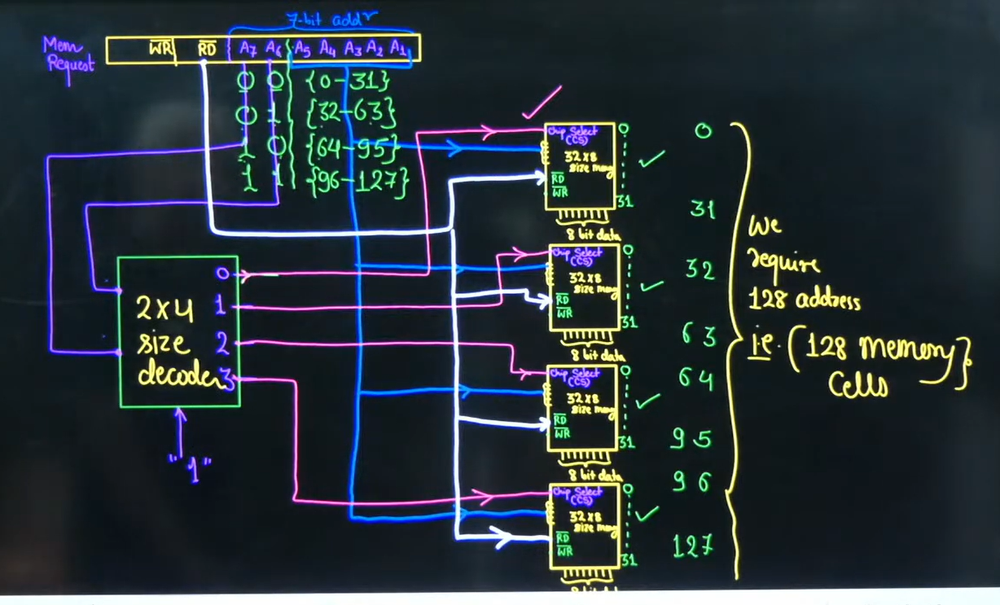

# Q. Why can't I rename or delete a file while it is open in another application (e.g., WPS or Excel)?

### Answer

When an application opens a file, it requests a **file handle** from the operating system along with **sharing permissions** (read, write, delete, rename).

If the application requests **exclusive access** (disallowing write/delete/rename), the operating system prevents other processes from performing those operations.

This is done to:

* Prevent **race conditions**
* Maintain **data consistency**
* Avoid **file corruption** during concurrent modifications

The limitation is **not** because the OS cannot perform read and write simultaneously. It is a **synchronization mechanism** enforced by the operating system based on the application's requested sharing mode.

**Key takeaway:**

> The OS allows concurrent access only when the sharing permissions of all processes are compatible.

---

# Follow-up: Can multiple programs read the same file simultaneously?

**Answer:** Yes.

Multiple processes can read the same file at the same time because reading does not modify the file.

Example:

* VLC playing a video
* Antivirus scanning it
* Backup software copying it

All can read simultaneously.

---

# Follow-up: Can one process read while another writes?

**Answer:** Yes, if the application and operating system allow it.

Example:

* A log file being continuously written by a server while another program reads it (`tail -f` in Linux).

However, applications like PDF editors or Excel usually prevent this because they rewrite file structures during saving, increasing the risk of corruption.

---

# Follow-up: Why is renaming considered a write operation?

**Answer:**

The filename is stored as **filesystem metadata** (directory entries), not inside the file itself.

Renaming updates this metadata, so the operating system treats it as a **modification** and checks whether the file allows rename/delete operations.

---

# Follow-up: What is a file handle?

**Answer:**

A **file handle** is an operating system object that represents an open file. It stores:

* File location
* Access mode (Read/Write)
* Current file pointer
* Sharing permissions

Applications interact with files through the handle rather than directly accessing the disk.

---

# Follow-up: What is a race condition?

**Answer:**

A **race condition** occurs when multiple threads or processes access and modify the same resource simultaneously, and the final result depends on the order of execution.

The operating system uses **file locks** and synchronization mechanisms to prevent such conflicts.

---

## One-line interview answer

> "When a process opens a file, it obtains a file handle with specific sharing permissions. If it requests exclusive access, the operating system blocks conflicting operations like rename or delete to prevent race conditions, maintain consistency, and avoid data corruption. The OS supports concurrent access, but only when the requested sharing modes are compatible."

---

## Q: How many memory chips of size **32 × 8 bits** are required to design a **128 × 8-bit** memory? How are they connected?

### Answer:

A **32 × 8** memory chip provides **32 memory locations**, each storing **8 bits**.

To build a **128 × 8** memory:

* Required memory locations = **128**
* Memory locations per chip = **32**

Therefore,

[
\frac{128}{32} = 4 \text{ chips}
]

All chips share the **8-bit data bus**, **Read (RD)**, and **Write (WR)** control signals.

The **lower 5 address bits** (`2⁵ = 32`) select a location **within a chip**, while the **upper 2 address bits** (`2² = 4`) are connected to a **2-to-4 decoder**, which generates the **Chip Select (CS)** signal to activate exactly **one** of the four memory chips.

---

### Interviewer's Follow-up: Why is a decoder required?

**Answer:**

A decoder ensures that **only one memory chip is active** for any given address. Without it, multiple chips could respond simultaneously, causing incorrect data to be read or written.

---

### 💡 One-line Interview Summary

> **Memory expansion is achieved by increasing the number of memory chips, while a decoder uses the higher-order address bits to select the appropriate chip and the lower-order address bits select the location within that chip.**

