# Chapt 1: Introduction to Computer Architecture (Smruti Sarangi)

## What is Computer Architecture?

Answer : It is the study of computers?

* **Computer Architecture**
  * The view of a computer as presented to software designers
* **Computer Organization**
  * The actual implementation of a computer in hardware

What is a computer?

A computer is a general purpose device that can be programmed to process information, and yield meaningful results.

## How does it work?

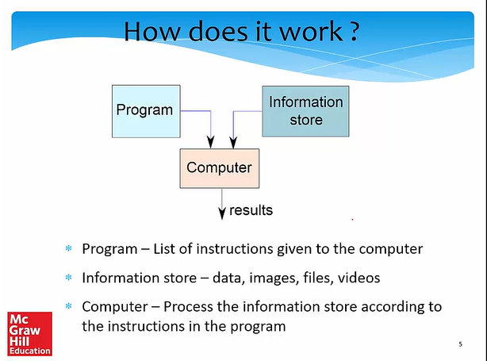

## What does a computer look like?

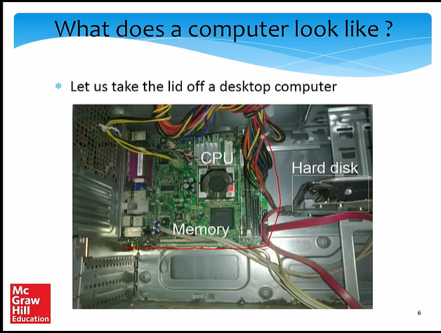

* In this course we will be primarily see - CPU, Memory and harddisk

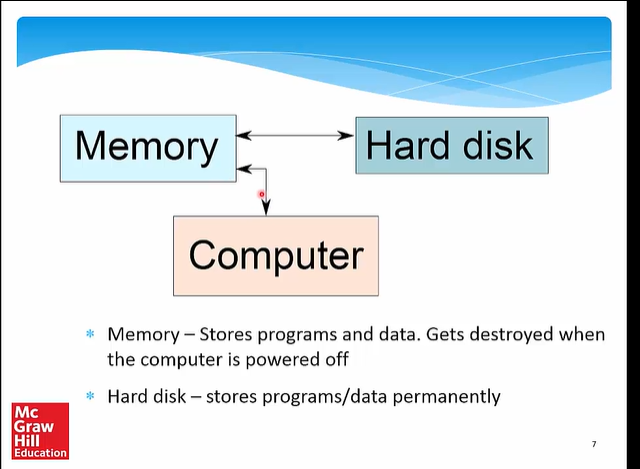

* Let us make it a full system ...

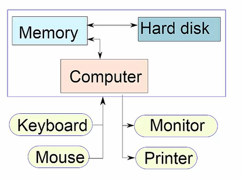

* Food for Thought - What is most intelligent computer?

Answer - Our brilliant brains

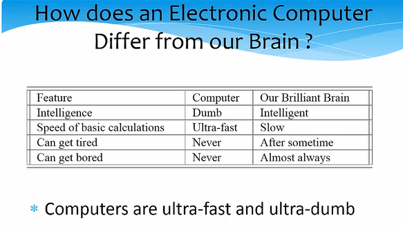

* How to Instruct a Computer

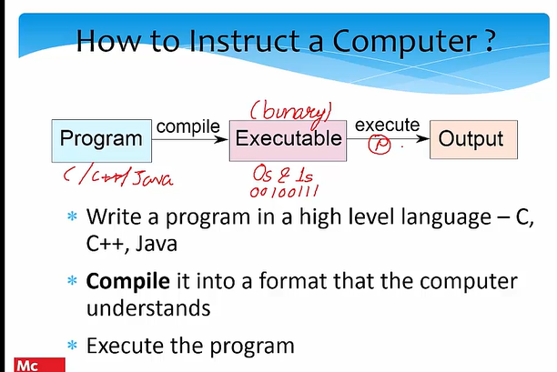

## What Can a Computer Understand?

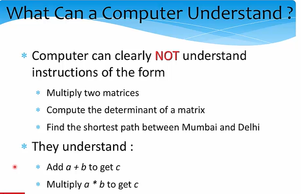

## The Language of Instructions

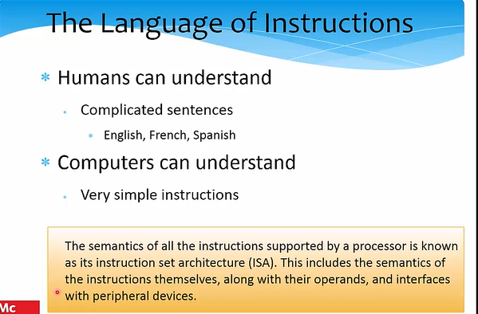

What is ISA - It is set of Instructions

## Features of an ISA

* Example of instructions in an ISA
  * Arithmetic instructions : add, sub, mul, div
  * Logical instructions : and, or , not
  * Data transfer/movement instructions
* Complete
  * It should be able to implement all the programs that users may write

## Features of an ISA - 2

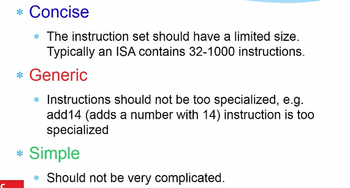

## Designing an ISA

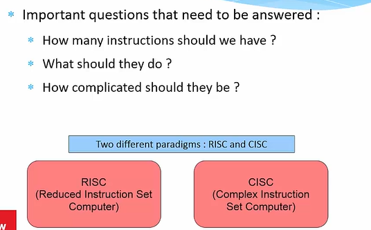

## RISC VS CISC

A reduced instruction set computer (**RISC**) implements
simple instructions that have a simple and regular
structure. The number of instructions is typically a small
number (64 to 128). **Examples: ARM, IBM PowerPC,
HP PA-RISC**  

A complex instruction set computer (**CISC**) implements
complex instructions that are highly irregular, take multiple
operands, and implement complex functionalities.
Secondly, the number of instructions is large (typically
500+). **Examples: Intel x86, VAX**

## Summary Uptil Now ...

* **Computers** are dumb yet ultra-fast machines.
* **Instructions** are basic rudimentary commands used to
communicate with the processor. A computer can execute
billions of instructions per second.

* The **compiler** transforms a user program written in a high level language such as C to a program consisting of basic machine instructions.
* The **instruction set architecture(ISA**) refers to the semantics of all the instructions supported by a processor.
* The instruction set needs to be **complete**. It is desirable if it is also **concise**, **generic**, and **simple**.

## Outline

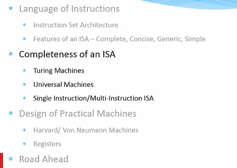

## Completeness of an ISA

* **How can we ensure that an ISA is complete?**

* Complete means :
  * Can implement all types of programs
  * For example, if we just have **add** instructions, we cannot subtract(**NOT Complete**)

a + b = a - (0-b)

## Completeness of an ISA - 2

How to ensure that we have just enough
instructions such that we can implement every
possible program that we might want to write ?

Skip this part(Optional)

* Answer

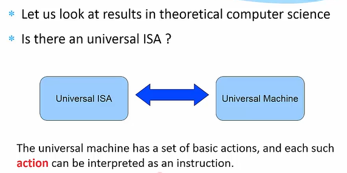

## The Turing Machine - Alan Turing

* Facts about Alan Turing
  * Known as the father of computer science
  * Discovered the Turing machine that is the most powerful computing device known to man
  * Indian connection : His father worked with the Indian Civil Service at the time he was born. He was posted in Chhatrapur, Odisha.

* **Turing Machine**

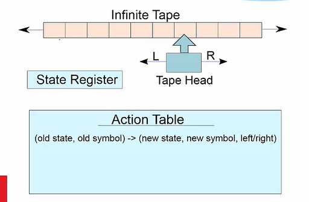

### Operation of a Turing Machine

* There is an inifinite tape that extends to the left and right. It consists of an infinite number of cells.
* The tape head points to a cell, and can either move 1 cell to the left or right
* Based on the symbol in the cell, and its current state, the Turing machine computes the transition :
  * Computes the next state
  * Overwrites the symbol in the cell (or keeps it the same)
  * Moves to the left or right by 1 cell
* The action table records the rules for the transitions.

### Example of a Turing Machine

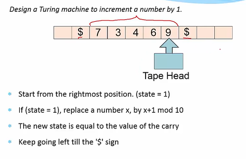

=> More about the Turing Machine

* This machine is extremely simple, and extremely
powerful
  * We can solve all kinds of problems - mathematical problems, engineering analyses, protein folding, computer games, ...
  * Try to use the Turing machine to solve many more types of problems (**TODO**)

Book on Automata theory or theoritical computer science.

## Church-Turing Thesis

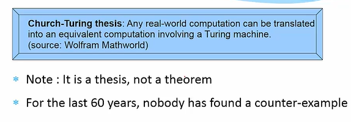

**Definition** - Any computing system that is equivalent to a Turing machine is said to be Turing complete.

## Universal Turing Machine

* For every problem in the world, we can design a Turing Machine (Church-Turing thesis)
* Can we design a universal Turing machine that can simulate any Turing machine. This will make it a **universal machine (UTM)**
* Why not? The logic of a Turing machine is really simple. We
need to move the tape head left, or right, and update the symbol and state based on the action table. **A UTM can easily do this.**
* A UTM needs to have an action table, state register, and tape that can simulate any arbitrary Turing machine.

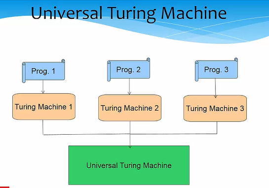

=> How does A Universal Turing Machine work?

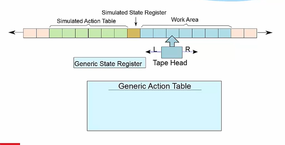

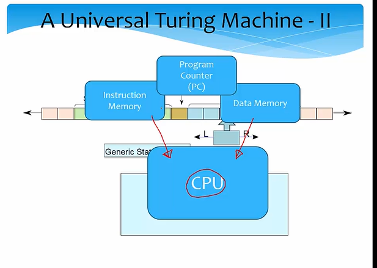

## Computer Inspired from the Turing Machine

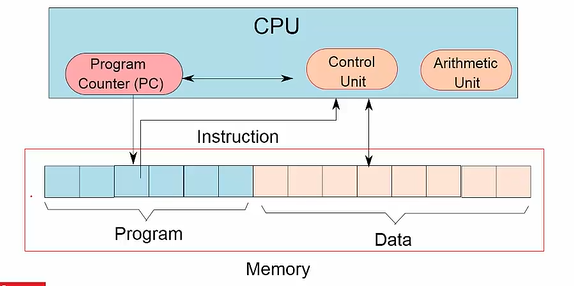

## Elements of a Computer

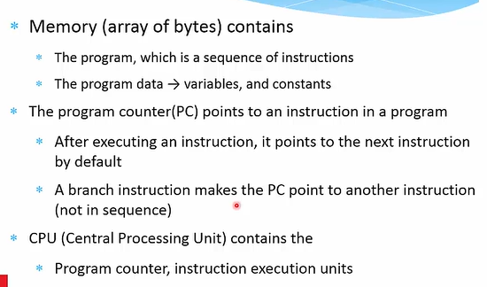

## Let us now design an ISA

* Single Instruction ISA
  * sbn - subtract and branch if negative
* Add (a+b) (assume temp = 0)

1 : sbn temp, b, 2  
2 : sbn a, temp, exit  

## Single Instructions ISA - 2

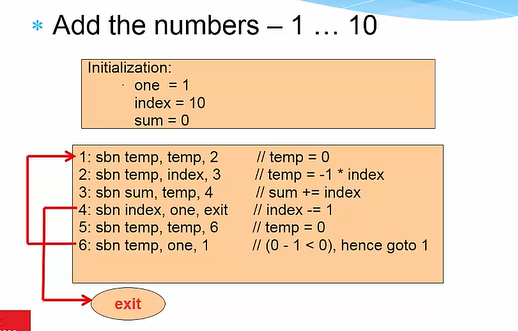

## Multiple Instruction ISA

* Arithmetic Instructions
  * add, subtract, multiply, divide
* Logical Instructions
  * or, and, not
* Move instructions
  * Transfer values between memory locations
* Branch instructions
  * Move to a new program location, based on the values of some memory locations

## Designing Practical Machines

* Harvard Architecture

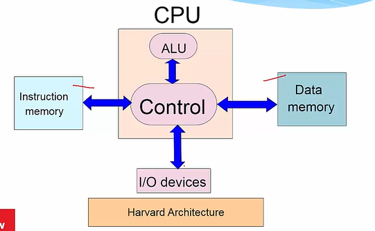

* Von-Neumann Architecture

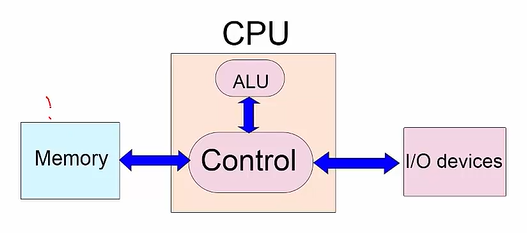

## Problems with Harvard/Von-Neumann Architectures

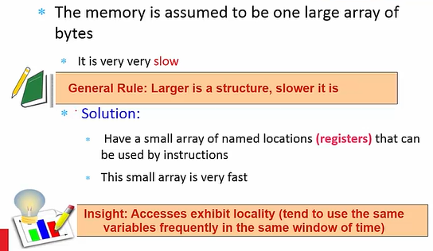